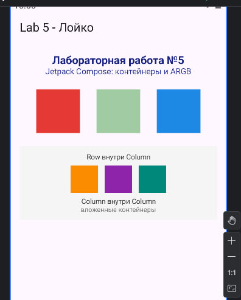

# Лабораторная работа №5 - Jetpack Compose: контейнеры, ARGB и Material Design

**Студент:** Лойко Арина Станиславна, группа ИСП-232

## Цель работы

Повторить основы разработки UI на Jetpack Compose, работу с контейнерами Row и Column, познакомиться с ARGB-моделью цветов, компонентом Scaffold и принципами Material Design

## Описание приложения

Приложение демонстрирует основные возможности Jetpack Compose:

- Scaffold с TopAppBar
- Column как основной контейнер экрана
- Row с тремя цветными квадратами в ARGB-формате (один полупрозрачный)
- Вложенные контейнеры Row и Column
- Заголовок из двух строк текста
- Цвета в ARGB-формате через Color(0xAARRGGBB)

## Скриншот

